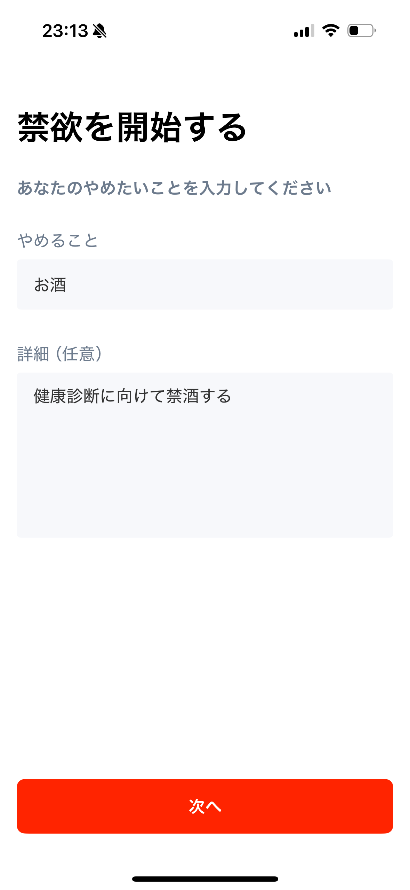
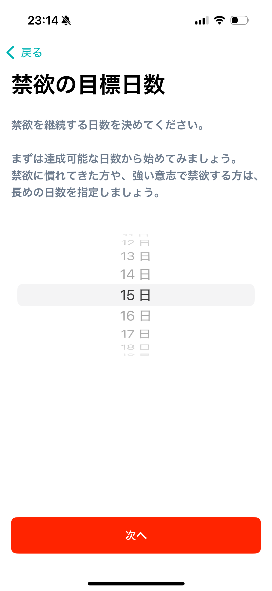
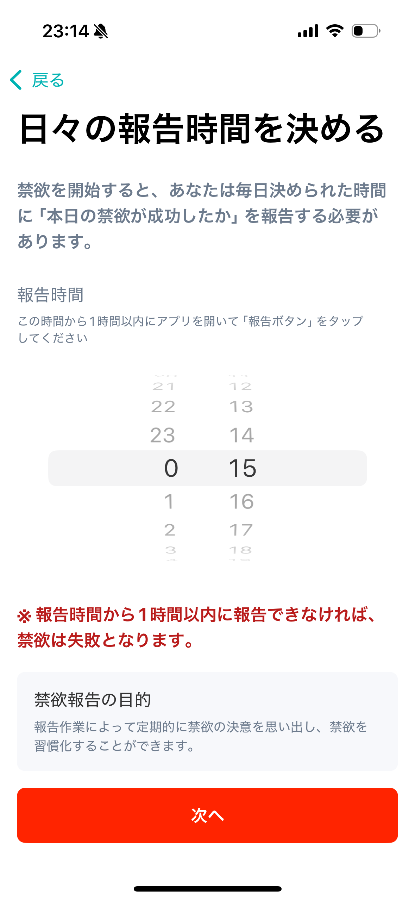
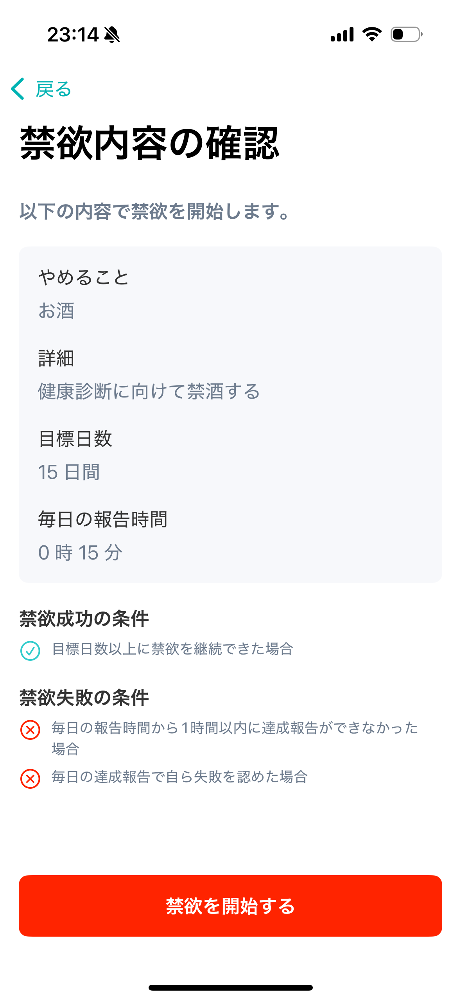
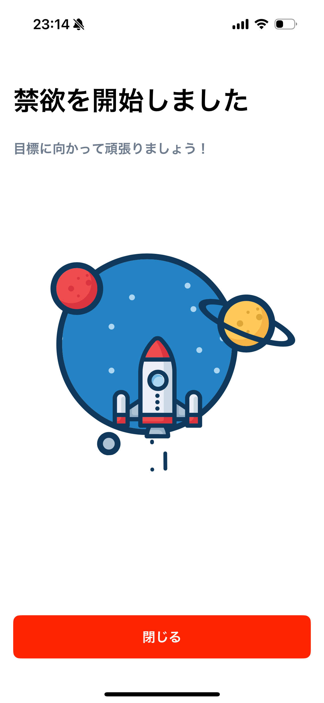
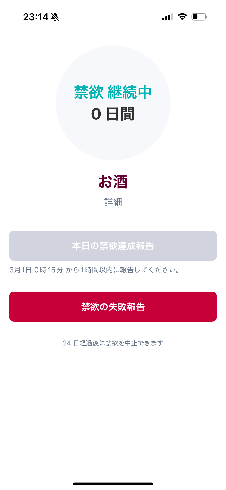
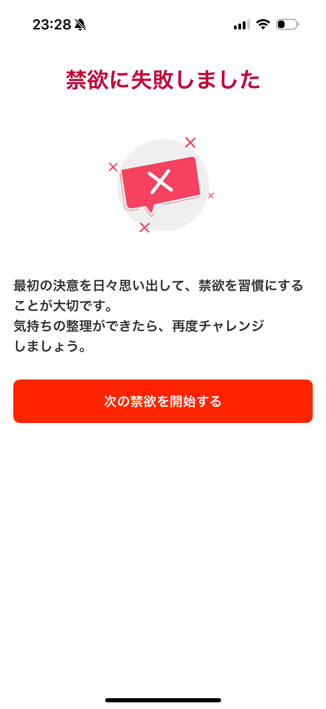
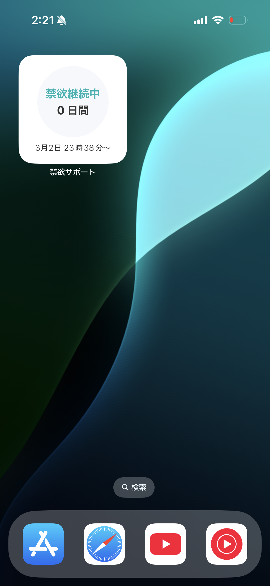
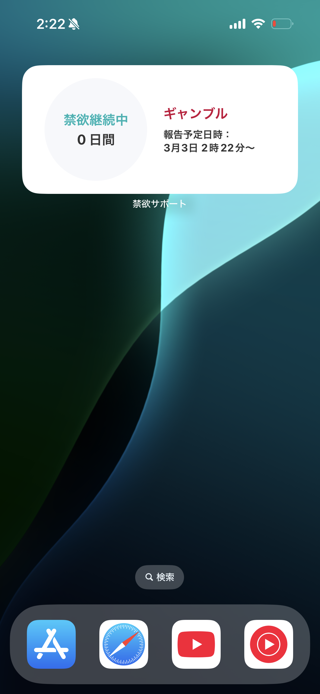
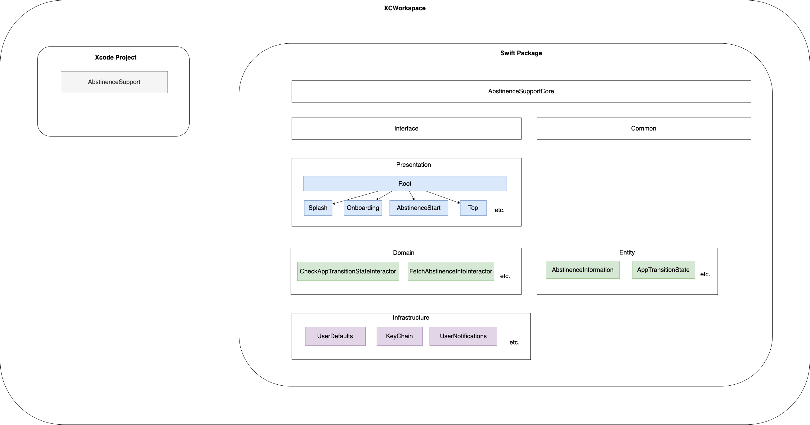

# 禁欲サポート

<p align="left">
  
</p>

ユーザーの悪習慣🍫🍺🚭を断つ道のりをサポートする禁欲アプリです。

[](https://apps.apple.com/us/app/%E7%A6%81%E6%AC%B2%E3%82%B5%E3%83%9D%E3%83%BC%E3%83%88/id6742044120)

## スクリーンショット

### 禁欲情報入力画面

| 禁欲名 | 目標日数 | 報告予定時間 | 確認 | 完了 |
| --- | --- | --- | --- | --- |
|  |  | ! |  |  |

### トップ画面

| 禁欲中 | 禁欲成功 | 禁欲失敗 |
| --- | --- | --- |
|  |  |  |

### ウィジェット表示

| systemSmall | systemMedium |
| --- | --- |
|  |  |

## Requirements

* Xcode 16.2
* iOS 17.0 

## 環境構築

## アーキテクチャ

<details><summary>ディレクトリ構成</summary>

```md
├── AbstinenceSupport.xcworkspace
├── AbstinenceSupportPackage
│   ├── Package.swift
│   ├── Sources
│   │   ├── AbstinenceSupportCore
│   │   ├── Common
│   │   ├── Domain
│   │   ├── Entity
│   │   ├── Infrastructure
│   │   ├── Interface
│   │   ├── Presentation
│   │   └── TestHelper
│   └── Tests
│       ├── DomainTests
│       ├── EntityTests
│       └── InfrastructureTests
├── DefaultTestPlan.xctestplan
├── Projects
│   └── AbstinenceSupport
│       ├── AbstinenceSupport
│       ├── AbstinenceSupport.xcodeproj
│       ├── AbstinenceSupportWidget
│       ├── AbstinenceSupportWidgetExtension.entitlements
│       ├── Default.xcconfig
│       └── PrivacyInfo.xcprivacy
└── README.md
```

</details>

### プロジェクト構成



* Interface モジュール
    - ViewModel, Interactor, Infrastructure の各コンポーネントが準拠するプロトコルを定義する
    - 各モジュールはここで定義されたプロトコルに対して依存し、具象型には依存しないようにする
* Presentation モジュール
    - 画面処理を担う View, ViewModel を実装する
        - View は SwiftUI で実装
        - View に表示するデータは ViewModel で生成
        - ViewModel は Domain モジュールに対して依存して処理を実行し、必要な情報を取得
* Domain モジュール
    - ビジネスロジックを担う Interactor を実装する
        - Infrastructure モジュールに対して依存して処理を実行し、必要な情報を取得
* Infrastructure モジュール
    - アプリの外部システムと連携・通信する処理を担う
        - KeyChain, UserDefaults などに対するデータ操作
        - UserNotifications, ATT などのフレームワークに依存する処理
* Entity モジュール
    - 主にドメインロジックで扱うモデルを定義するモジュール
    - 本アプリでは直接 ViewModel に Entity を渡して画面表示にも使用

### 採用技術

| 分類                | 技術                              |
| ----------------- | ------------------------------- |
| UI                | SwiftUI                         |
| ライブラリ管理           | Swift Package Manager           |
| 非同期処理             | Swift Concurrency               |
| DB                | UserDefaults, KeyChain          |
| DI                | swift-dependencies              |
| 行動分析              | Firebase Analytics, Crashlytics |
| テスト               | Swift Testing                   |
| Linter, Formatter | swift-format                    |

### コーディング規約

[API Design Guidelines](https://www.swift.org/documentation/api-design-guidelines/) に従う。
